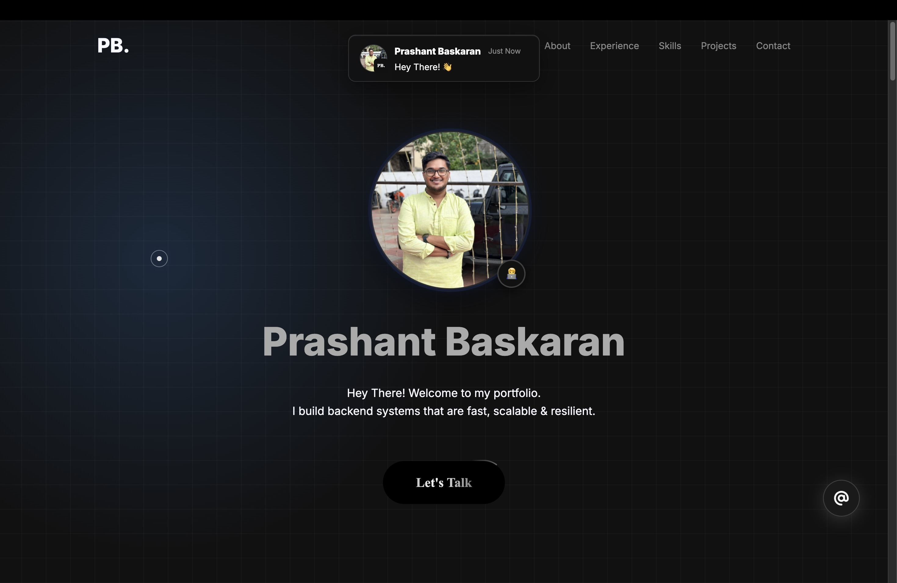

Hey there! Welcome to my GitHub page.

<h1 align="center">Prashant Baskaran </h1>
<h3 align="center">Backend Developer | Scalable APIs & Real-time Systems</h3>

 

## 🤔 Who Am I?
I’m a tech enthusiast with a knack for turning coffee into code. I graduated from SRM Institute of Science and Technology in 2022 and kicked off my career at TCS, where I dabbled in everything from jQuery, SpringMVC, Struts and more. I even had a brief foray into business process management with the PMO Office.

Since then, I've expanded into the fast-paced startup and consulting world. I thrive on taking end-to-end ownership of projects and architecting solutions built for high performance and scalability. And with Peritys, I delivered scalable, production-grade systems.

## 🌟 Featured: My Portfolio
**Check out my interactive portfolio website!** 

  
   
  <a href="https://prashant42b.vercel.app" target="_blank">🚀 Click here to visit</a>

 

## 💼 Experience Highlights
- **Back End Developer - I** @ Peritys | *May 2024 - May 2025*
  - Led end-to-end development of real-time transportation systems using WebSockets, Redis, and AWS.
- **Assistant System Engineer** @ TCS | *July 2022 - May 2024*
  - Built workflow-driven enterprise platforms and data-driven prediction dashboards.
- **Technical Consultant** @ Independent Consulting (DLearners) | *Dec 2025*
  - Provided long-term modernization roadmaps, and recommended security, scalability enhancements after a technical assessment.

## 🔭 My Toolkit
- **Languages:** Python, Java, GoLang, SQL, JavaScript, HTML, CSS
- **Backend & Frameworks:** Flask, FastAPI, Go-Fiber, SpringMVC
- **Databases:** MongoDB, PostgreSQL, Oracle DB, Redis, ElasticSearch
- **Cloud & DevOps:** AWS (EC2 deployments, S3, SNS, SQS), Docker, Vercel deployment
- **Tools & Tech:** WebSockets, JWT, Apache Solr, Firebase, GORM, Sentry

## How I Roll
I tackle challenges with a mix of curiosity and humility, knowing there's always more to learn. I love collaborating with others and soaking up different perspectives – it's the best way to grow and make cool things happen. Currently, I specialize in building robust backend ecosystems.

## ⚡ Fun Fact
Until Jan 2024, I didn't even know how to use version-control (Git/GitHub), and since then it has been a journey of intense hands-on learning with real stakes. Looking back it's crazy to think about the amount of skills of varying nature that I've come to learn, experiment and enjoy building on. Boy, it's been a ride.

## 💬 Hit me up!
If you're a developer 💻, feel free to reach out if you'd like to discuss tech, coding, or just share ideas. I'm always up for a good conversation, learning from diverse perspectives, or connecting on [LinkedIn](https://www.linkedin.com/in/prashant42b/).

 

<h2>Socials</h2>

  

